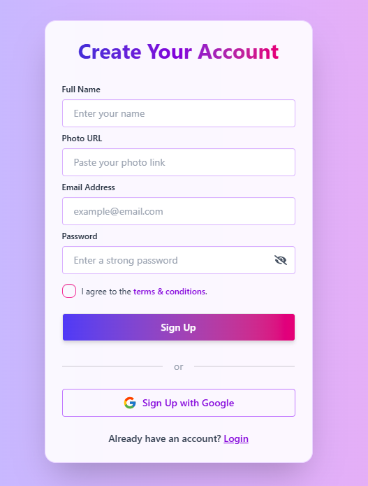

# 🌐 SkillSwap Platform

A modern, responsive, and user-friendly **React + Firebase** based web application designed to deliver online learning experiences with a beautiful UI, smooth animations, and secure authentication system.

---

## 🚀 Live Demo

🔗 [View Live Project](https://skillswap-platform-sm.netlify.app)

---

## 🧠 Project Overview

This project is a **SkillSwap Platform** that allows users to:
- Register, log in, and manage their profiles.
- Explore multiple online courses (Full Stack Development, Marketing, Video Editing, Python, etc.).
- View responsive and animated slides for each course.
- Update their name, avatar, and other personal details in profile.
- Reset passwords securely using Firebase Authentication.
- Experience smooth UI transitions and toast notifications.

The design is **responsive**, **fast**, and **optimized for all devices**.

---

## ⚙️ Key Features

✅ **Firebase Authentication** – Email/password signup, login, logout, and password reset  
✅ **Profile Management** – Update name, avatar, and view user info in real-time  
✅ **Dynamic Sliders** – Auto and manual slides using Swiper.js  
✅ **Smooth Animations** – AOS (Animate on Scroll) effects throughout the UI  
✅ **Toast Notifications** – Real-time feedback using `react-hot-toast`  
✅ **Responsive Navbar & Routing** – Managed via `react-router`  
✅ **Loading Spinners** – Custom loaders with `react-spinners`  
✅ **Modern UI** – Built using `TailwindCSS` and icons from `lucide-react` & `react-icons`

---

## 🧩 Tech Stack

| Category | Technology |
|-----------|-------------|
| Frontend | React (v19.1.1) |
| Styling | Tailwind CSS (v4.1.15) |
| Animations | AOS (v2.3.4), Swiper (v12.0.3) |
| Routing | React Router (v7.9.4) |
| Backend / Auth | Firebase (v12.4.0) |
| Notifications | React Hot Toast (v2.6.0) |
| Icons | React Icons (v5.5.0), Lucide React (v0.546.0) |
| Loading UI | React Spinners (v0.17.0) |
| Build Tool | Vite with Tailwind Plugin & DaisyUI|

---


## 📁 Folder Structure

```
src/
 ┣ assets/              # Images, icons, and media
 ┣ components/          # Reusable UI components (Navbar, Slider, etc.)
 ┣ contexts/            # AuthContext (Firebase integration)
 ┣ layout/              # Manage structure
 ┣ pages/               # Page components (Home, Profile, Login, etc.)
 ┣ Routes/              # Root component
 ┣ main.jsx             # Entry point
 ┗ index.css            # Tailwind base and custom styles
```

---
## 📸 Screenshots

### 🏠 Home page


### 📰 Course Details Page


### 🔐 Sign Up Page


---


## 🔒 Environment & Security

- Firebase credentials are securely managed via environment variables.
- Sensitive data is never hardcoded.
- Authentication and user sessions are handled via Firebase Auth.

---

## 🧑‍💻 Developer Notes

- Built using **React 19** and **Vite** for ultra-fast development.
- UI fully responsive and mobile-friendly.
- Clean code, modular structure, and reusable components.
- Deployed on **Firebase Hosting** or **Netlify**.

---

## 🧷 Future Enhancements

- Sign IN & Sign Up user friendly
- Password reset option    
- View course details & Book a Session
- Implement progress tracking per user  
- Add instructor and admin panel 

---

## 💬 Feedback & Support

If you have any suggestions or feedback, feel free to:
- Open an issue on [GitHub Issues](https://github.com/your-username/your-repo-name/issues)
- Or contact me directly through email/socials (optional)

---


⭐ **Don’t forget to give this repo a star if you like it!**
